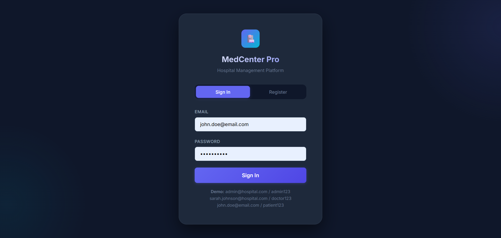
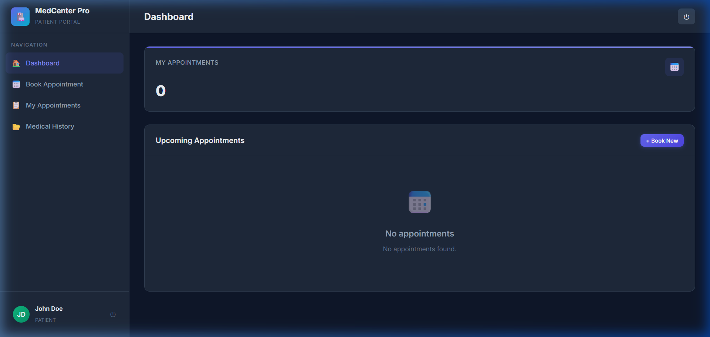
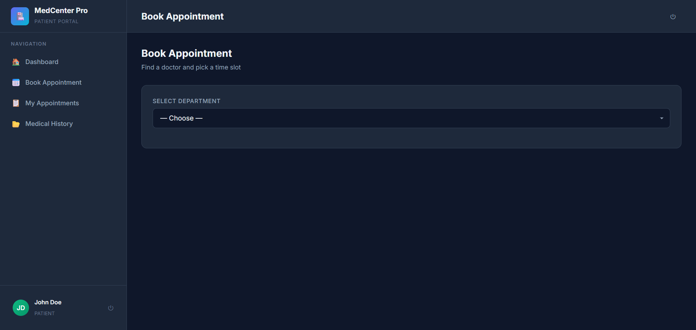
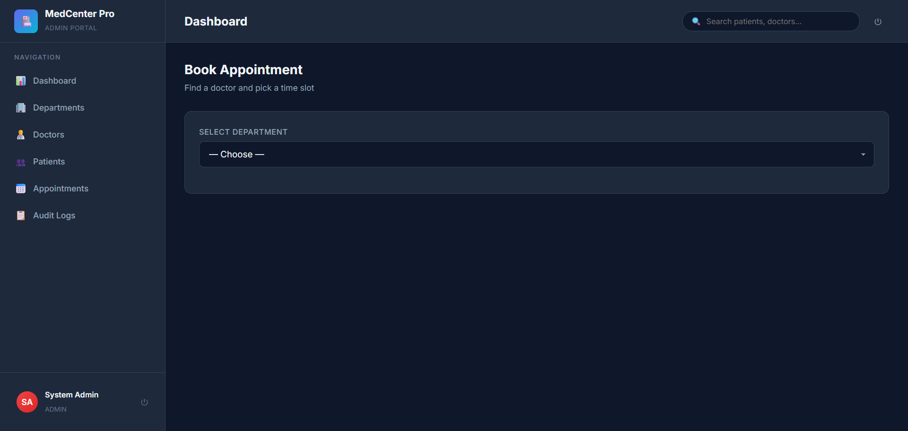
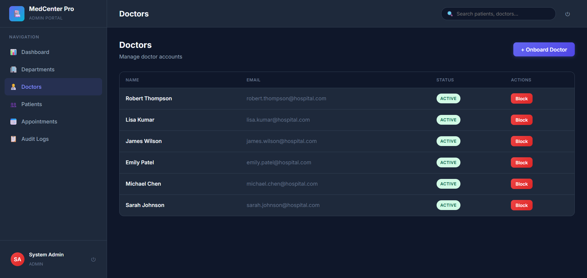
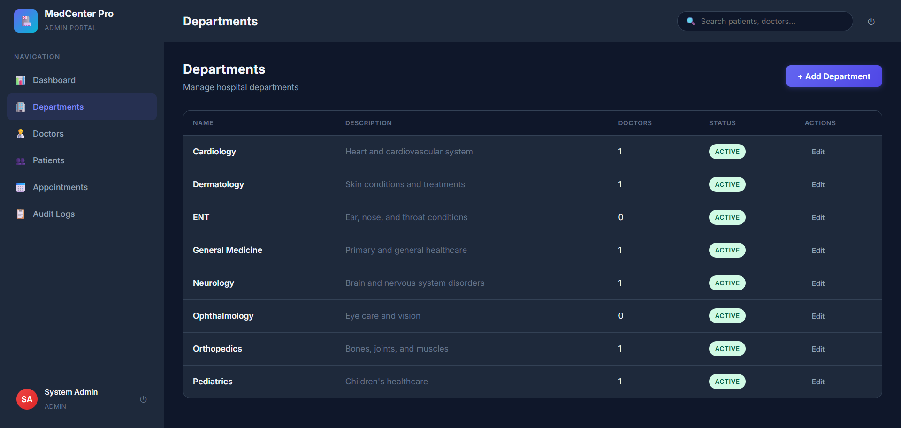

# Hospital Management System

A comprehensive web-based platform for managing hospital operations, patient records, doctor schedules, and administrative tasks.

## 📸 Workflow & Screenshots

### 1. Secure Login Portal


### 2. Patient Dashboard


### 3. Patient Appointment Booking


### 4. Admin Dashboard Oversight


### 5. Admin Doctors Directory


### 6. Admin Department Settings


## 🚀 Key Features

*   **Role-Based Access Control (RBAC):** Distinct portals and capabilities for Admin, Doctor, and Patient users.
*   **Patient Management:** Registration, medical history tracking, and patient portals.
*   **Appointment Booking:** Streamlined scheduling interface for patients to book visits with available doctors.
*   **Doctor Availability:** Real-time schedule management for healthcare professionals.
*   **Administrative Oversight:** Holistic view of hospital metrics, departmental management, and system auditing.

## 💻 Tech Stack

*   **Backend:** FastAPI (Python)
*   **Database:** SQLite (managed via SQLAlchemy ORM)
*   **Migrations:** Alembic
*   **Authentication:** JWT (JSON Web Tokens), bcrypt for password hashing
*   **Frontend:** Vanilla JavaScript, HTML5, Modular CSS
*   **Data Validation:** Pydantic

## ⚙️ Setup and Installation

### Prerequisites
*   Python 3.9+
*   Node.js (Optional, for frontend tooling if expanded)

### Local Development

1.  **Clone the Repository**
    ```bash
    git clone https://github.com/aanuja2208/hospital-management-system.git
    cd hospital-management-system
    cd backend
    ```

2.  **Environment Setup**
    ```bash
    python -m venv venv
    source venv/bin/activate  # On Windows: venv\Scripts\activate
    pip install -r requirements.txt
    ```

3.  **Database Configuration**
    Generate a secret key and set up your `.env` file (copy from `.env.example` if available).
    Run migrations:
    ```bash
    alembic upgrade head
    ```

4.  **Seed Initial Data (Optional)**
    ```bash
    python seed.py
    ```
    *This creates default admin (`admin@hospital.com` / `admin123`) and sample users.*

5.  **Run the Server**
    ```bash
    uvicorn app.main:app --reload --port 8000
    ```
    Navigate to `http://127.0.0.1:8000` to interact with the application.

## 🗺️ Walkthrough

1.  **Start at the Login Page**: Users arrive at the login page where authentication directs them to their specific dashboard based on their assigned role in the system.
2.  **Patient Flow**: Patients can view their upcoming appointments, browse available doctors by department, and request new bookings based on real-time availability.
3.  **Admin Flow**: Administrators have full system visibility, allowing them to manage users, add new departments, review audit logs, and oversee all scheduled encounters within the clinic.
